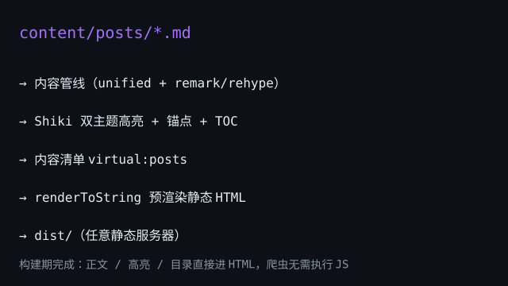

这是 hacxy.cn 重建后的第一篇技术文章。目标很简单：**用 Markdown 写文章，提交即发布，内容直接进 HTML，爬虫不执行 JS 也能读全文**，同时给后续功能（RSS、搜索、归档）留好接缝。

整体流程如图所示：文章在构建期一次性完成渲染，产物是纯静态文件。



## 渲染策略：构建期一次性渲染

核心决策是把 Markdown 渲染完全放在**构建期**：

- 构建时对每篇文章运行 unified 管线，产出 HTML 字符串（含代码高亮与锚点）
- 客户端用 `dangerouslySetInnerHTML` 挂载同一字符串
- 服务端与客户端内容完全一致，**从根上杜绝 hydration mismatch**

客户端 JS 因此保持轻量——它只负责水合与导航，不携带任何渲染逻辑。

## 内容管线

管线由 unified 生态组装，全部只在构建期运行：

```ts
const processor = unified()
  .use(remarkParse)
  .use(remarkGfm) // 表格、任务列表
  .use(remarkRehype)
  .use(rehypeCodeHighlight) // Shiki 双主题高亮
  .use(rehypeHeadingAnchors) // 标题锚点 id
  .use(rehypeStringify)
```

### 代码高亮：Shiki 双主题

高亮用 Shiki，`github-light` / `github-dark` 双主题同时写入 HTML：亮色作为内联样式，暗色作为 CSS 变量（`--shiki-dark`）。暗色模式切换时**无需重新生成 HTML**，只需一段 CSS 切换变量。

```ts
const html = highlighter.codeToHtml(code, {
  lang: 'ts',
  themes: { light: 'github-light', dark: 'github-dark' },
})
```

### 目录与锚点

标题由 github-slugger 生成锚点 id（中文标题原样保留），TOC 只收集 h2/h3，与标题锚点同树提取，id 天然一致。

## 部署形态

构建产物是纯静态目录，可以放到任意静态服务器：

| 路径           | 产物文件                                        | 托管方式       |
| -------------- | ----------------------------------------------- | -------------- |
| `/`            | `index.html`                                    | 任意静态服务器 |
| `/posts/:slug` | `posts/<slug>.html` + `posts/<slug>/index.html` | 双形态兼容     |
| `/about`       | `about.html` + `about/index.html`               | 同上           |
| 404            | `404.html`                                      | 真实服务器约定 |

## 踩过的坑

- **virtual 模块注入 HTML**：内容清单以 JSON 注入 `virtual:posts` 时，其中的相对图片路径会被 Vite 的 import 分析误解析——所以图片引用在管线内先重写为 `/assets/` 绝对路径
- **watch 目录**：插件 `addWatchFile` 只监听 `.md` 文件，监听目录会在测试环境触发误解析
- **YAML 日期**：js-yaml 会把 ISO 日期解析成 `Date` 对象，`updated` 字段需要与 `date` 同样规范化

## 下一步

- RSS / sitemap / OG 结构化数据
- 暗色模式与设计系统
- 标签归档页（tags 数据已入库）

这套架构的关键是把复杂度收敛在构建期：内容层是纯函数，页面层是薄渲染，测试缝清晰，后续扩展不会卡在技术债上。
